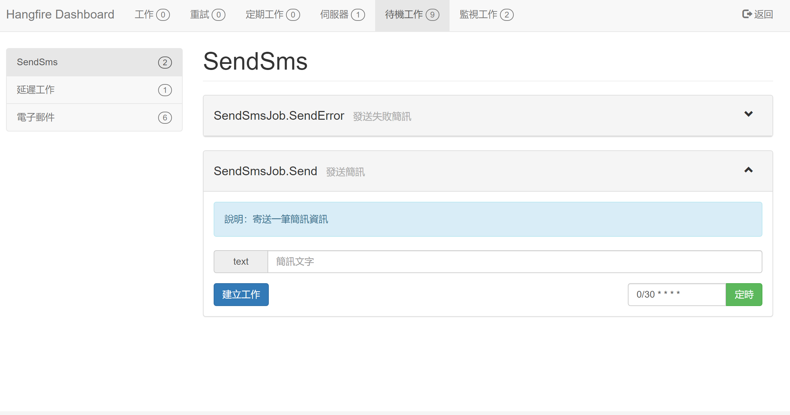

Hangfire.Jobkits
=========

[](https://www.nuget.org/packages/Hangfire.JobKits/)

## Overview

Inspired by [Hangfire.MissionControl](https://www.nuget.org/packages/Hangfire.MissionControl/) and [Swashbuckle - Swagger for WebApi](https://www.nuget.org/packages/Swashbuckle/).

Hangfire.Jobkits providers define standby job to launch on background or recurring.

## Features

### Standby Page


- **Definition job** : category job and method
- **Auto generate parameters** : get method parameters to queue job on hangfire.
- **Set recurring job** : do not add recurring job on startup.cs, you can launch job on recurring anytime.
- **Support anothers** : support denpendency injection and Hangfire.Console 

### Monitor Page


- **Period monitor** : get daily, weekly and monthly job list.
- **Execute status** : assign job check time range, you can check status after job is executed.
- **Custom vaildate** : while job is executed, you can trigger customize validate function to display on monitor list.

## Job Singleton 

- **Limit job** : only single job on enqueued and processing pool.
## Steup

In .Net Core's Startup.cs:

``` c#
public void ConfigureServices(IServiceCollection services)
{
    services.AddHangfire(config =>
    {
        config.UseSqlServerStorage("connectionSting");
        // Standby page
        config.UseJobkits(typeof(Startup).Assembly);
        // Monitor page
        config.UseJobMonitor(typeof(Startup).Assembly);
    });
}
```

Otherwire,

``` c#
GlobalConfiguration.Configuration
    .UseSqlServerStorage("connectionSting")
    .UseJobkits(typeof(Startup).Assembly)
    .UseJobMonitor(typeof(Startup).Assembly);
```

### Additional options

- **AlwaysCollapsed** : job method is collapsed on pageload. (default: **false**)
- **RequireConfirmation** : you must confirm after you launch job. (default: **false**)
- **RecurringTimeZone** : recurring job cron timezone (local or UTC),default is local.

``` c#
GlobalConfiguration.Configuration
    .UseJobkits(new JobKitOptions
                {
                    AlwaysCollapsed = true,
                    RequireConfirmation = true
                    RecurringTimeZone = TimeZoneInfo.UTC
                }, 
                typeof(Startup).Assembly);
```

## Definition Attributes

Decorate you code on standby jobs.
- **JobLauncher** : category you job collection
- **JobMethod** : display job to queue on categoory page
- **JobParam** : describe you param on method

``` c#
[JobLauncher]
public class ReportJob
{
    [JobMethod]
    public void Process(DateTime start, DateTime end)
    {
        //code ... 
    }
}
```

### JobLauncher

- **CategoryName** : define category name on  sidebar of standby page

``` c#
// ReportJob.cs
[JobLauncher("Report")]
public class ReportJob
{
    //code ...
}

// MailJob.cs
[JobLauncher("Email")]
public class MailJob
{
    //code ...
}
```

### JobMethod

- **Name** : display name
- **Description** : describe this method how to do
- **UseQueue** : use queue state on background job

``` c#
[JobLauncher("Report")]
public class ReportJob
{
    [JobMethod("Process Report",
               Description = "the report that save login user ",
               UseQueue=true)]
    public void Process(DateTime start, DateTime end)
    {
        //code ... 
    }
}
```

if you use queue to prioritize jobs, you need to update your **BackgroundJobServer** configuration

``` c#
var options = new BackgroundJobServerOptions
{
    Queues = new[] { "critical", "default" }
};

app.UseHangfireServer(options);
```

if the method use to recurring job, you must be setting : 

- **RecurringJobId** : assign id for this method can launch on recurring job
- **RecurringJobCron** : default reccuring job cron value

``` c#
[JobLauncher("Report")]
public class ReportJob
{
    [JobMethod(RecurringJobId = "Report.Process",
               RecurringJobCron = "00,30 * * * *")]
    public void Process(DateTime start, DateTime end)
    {
        //code ... 
    }
}
```

### JobParam

this attribute is option. you don't decorate that on method.

- **DefaultValue** : default value on input 
- **Description** : input placeholder

``` c#
[JobLauncher("Report")]
public class ReportJob
{
    [JobMethod]
    public void Process(
        [JobParam(Description = "start time", 
                  DefaultValue = "2018/10/20", )]DateTime start, 
        [JobParam(Description = "end time",
                  DefaultValue = "2018/10/30", )]DateTime end)
    {
        //code ... 
    }
}
```

## Monitor Attribute

Decorate you code on monitor page.
- **JobValidation** : job must be monitored, you can describe range and schedule time (cron).
- **CustomValidation** : inherit this **JobValidation** attribute, you can customize conditions to valid on any single job.

### JobValidation

- **Name** : display name
- **Cron** : compute scheulde time to every job on monitor page. 
- **Range** : define period category on sidebar of monitor page, enum variables: **Daily**, **Weekly**, **Monthly**.

``` c#
[JobLauncher("Report")]
public class ReportJob
{
    [JobMethod("Export file on members")]
    [JobValidation(Name = "Export Member's file", Cron = "0 0,12 * * *", Range = ValidateRangeType.Daily)]
    public void Process(DateTime start, DateTime end)
    {
        //code ... 
    }
}
```

### Customize JobValidation

if the method must be valid by customize, you can follow this code:

``` c#
public class CustomValidationAttribute : JobValidationAttribute
    {

        public CustomValidationAttribute() : base(typeof(CustomValidationFilter))
        { }

        private class CustomValidationFilter : JobValidationStateFilter
        {
            private IServiceProvider _serviceProvider;

            public CustomValidationFilter(IServiceProvider serviceProvider)
            {
                _serviceProvider = serviceProvider;
            }

            public override bool Validate()
            {
                // condition on custom
            }
        }

    }

```

You can use `IServiceProvider` to instance your module to get table or valid classes by dependency injection.

### JobSingleton

if your job cannot be repeated, you can append this attribute. It throws exception when job trigger two times.

``` c#
[JobLauncher(CategoryName = "Delay")]
public class DelayJob
{
    
    [JobSingleton]
    [JobMethod]
    public void Process(PerformContext context, int delaySec)
    {
        //code ...
    }
}
```

## License

Copyright (c) 2018 Crab Lin
